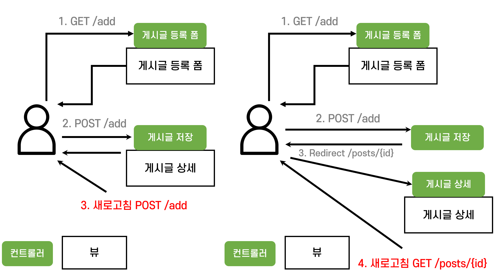

# Spring을 이용한 간단한 CRUD 게시판

## 목차
1. [**✍개발 목적**](#-개발-목적)
2. [**개발 환경**](#-개발-환경)   
3. [**프로젝트 요구사항**](#-요구사항)
4. [**프로젝트 구조**](#-프로젝트-구조)
5. [**기능**](#-기능)
6. [**느낀점**](#-느낀점)

## ✍ 개발 목적
스프링 백엔드 개발자가 되기 위한 기초역량으로 Spring MVC 구조에 대한 이해를 돕기 위해서 진행하였다.

## ✍ 개발 환경
- [JAVA](https://www.java.com/ko/)
- [Spring Boot](https://spring.io/)
- [Bootstrap](http://bootstrapk.com/)
- [Thymeleaf](https://www.thymeleaf.org/)
- lombok
- Gradle
- IntelliJ 2020.3.3


## ✍ 프로젝트 요구사항


게시글을 작성할 수 있는 게시판이 보여지고 다음 다섯가지 기능이 요구된다.

- 게시글 목록 조회
- 게시글 조회
- 게시글 작성
- 게시글 수정
- 게시글 삭제

새로운 게시글을 등록한 이후에는 게시글을 저장하고 저장된 게시글을 `저장 완료`라는 텍스트와 함께 웹브라우저에 보여준다.
등록한 게시글은 수정할 수 있으며 게시글을 수정한 이후에는 `수정 완료` 텍스트와 함께 수정된 게시글을 웹 브라우저에 보여준다.

## ✍ 프로젝트 구조

웹브라우저에서 URI 요청을 보내면 내장톰캣서버가 URI, Method에 따라 알맞은 컨트롤러를 찾아주고 해당 컨트롤러는 뷰를 반환한다. 템플릿에 있는 HTML 파일이 Thymeleaf과 함께 렌더링되어 웹브라우저에 보여진다.

이 프로젝트는 스프링의 기초를 다지기 위한 프로젝트이기 때문에 게시글에 대한 정보는 DB에 저장하지 않고 메모리기반 저장소를 사용하였다. 따라서 서버를 재시작하게 되면 기존 게시글의 정보가 사라진다. 이점은 추후 프로젝트에서 개선할 예정이다.

각 역할에 따라 URI를 다음과 같이 설계했다.
- 게시글 목록 조회 -> /board/posts
- 게시글 조회 -> /board/posts/{postId}
- 게시글 작성 -> /board/posts/add
- 게시글 수정 -> /board/posts/edit
- 게시글 삭제 -> /board/posts/delete

게시글 작성한 후, 작성한 게시글을 다시 보여줄 수 있도록 게시글 상세로 이동할 때는 같은 URI를 사용한다.
게시글작성은 `/board/posts/add`에서 `GET` 메서드로 요청하고, 게시글 작성 후 상세보기는 `POST`메서드로 요청해 같은 URI에서의 동작을 메서드로 구분하였다.

게시글을 작성 폼을 `POST` HTTP 메서드로 요청한 이후 나오는 상세페이지 에서 새로고침(F5)를 누르면 한번만 등록되어야 할 게시글이 새로고침한만큼 계속 등록된다. 이는 새로고침을 하게되면 마지막에 보낸 HTTP 요청을 보내게 되는데 이때 등록폼도 함께 보내지면서 게시글이 반복적으로 등록되는것이다.

이를 해결하기 위해서 PRG(Post-Redirect-Get) 구조를 사용하였다.
Post 메서드로 게시글 등록 폼을 받았다면 새로운 게시글페이지로 redirect 한다. 그렇게되면 클라이언트가 리다이렉트를 위해서 GET 요청을 보내게 되고 마지막에 보낸 HTTP 요청이 게시글 페이지를 요청하는 GET 메서드 요청이므로 새로고침할때마다 글이 등록되지 않는다.



소스코드에서도 뷰 이름을 반환하는 대신 리다이렉트를 통해 해당 URI에 다시 요청을 보내도록 하였다.

```java
@PostMapping("/add")
public String addPost(RedirectAttributes redirectAttributes,
                        @RequestParam String postTitle,
                        @RequestParam String postBody,
                        Model model) {
    Post newPost = new Post(postTitle, postBody, LocalDateTime.now(), 0);
    postRepository.save(newPost);

    log.info("newPost's id: {}", newPost.getId());

    redirectAttributes.addAttribute("postId", newPost.getId());
    redirectAttributes.addAttribute("addStatus", true);
    model.addAttribute("post", newPost);

    return "redirect:/board/posts/{postId}";
}
```

## ✍ 기능
### 게시글 목록 조회

/board/posts 에 접근하면 게시글 목록을 조회할 수 있다. 각 게시글마다 
- 게시글 id
- 제목
- 작성일시
- 조회수

의 정보가 주어진다. 게시글 제목을 클릭하면 해당게시글로 이동할 수 있다.

### 게시글 조회


게시글 목록에서 글 제목을 누르면 게시글로 이동할 수 있습니다.

### 게시글 등록


게시글을 등록한 이후에는 작성한 글을 확인하는 페이지로 넘어가며 게시글 목록으로 돌아갔을때 글이 추가된 것을 확인 할 수 있습니다.

### 게시글 수정


등록된 게시글에서 수정버튼을 누르면 게시글의 내용을 수정할 수 있습니다. 게시글의 제목은 변경할 수 없도록 해두었습니다.
수정 이후 제출 버튼을 누르면 `수정 완료` 메세지와 함께 수정된 게시글이 보여집니다.
게시글목록으로 가서 다시 해당 게시글을 눌러보면 수정된 것을 확인할 수 있습니다.

### 게시글 삭제


게시글 삭제 버튼을 누르면 게시글이 삭제되면서 목록으로 이동합니다. 게시글이 삭제된 것을 확인 할 수 있습니다.

## ✍ 느낀점